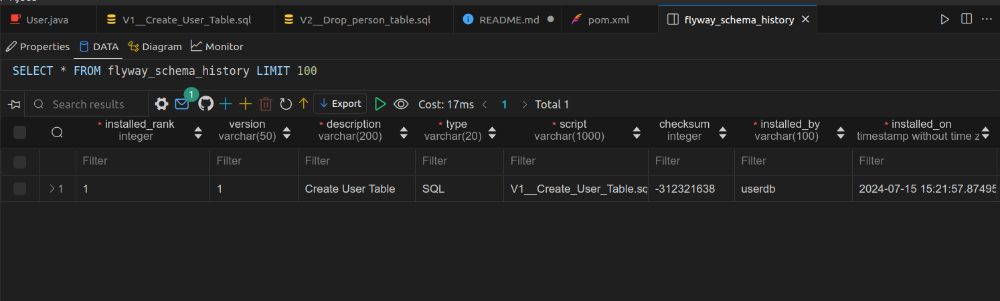
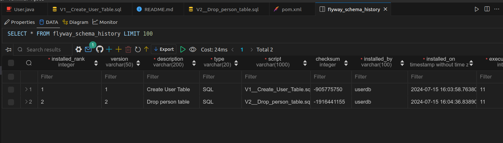

# Migrations com Flyway

## Visão Geral

Este projeto demonstra como usar o Flyway para gerenciar migrações de banco de dados em um projeto Java. O Flyway é uma ferramenta poderosa e fácil de usar para controle de versão de banco de dados, permitindo que você aplique, versione e controle alterações na estrutura do seus banco de dados de maneira eficiente.

## Por que usar o Flyway?

- **Controle de Versão:** Flyway permite versionar as mudanças no banco de dados, facilitando o rastreamento de alterações ao longo do tempo.
- **Reprodutibilidade:** As migrações podem ser reproduzidas facilmente em diferentes ambientes (desenvolvimento, teste, produção).
- **Automação:** Integração simples com ferramentas de automação e CI/CD, permitindo a aplicação automática de migrações.
- **Confiabilidade:** Garantia de que todas as alterações no banco de dados são aplicadas de maneira ordenada e consistente.
- **Reversibilidade:** Suporte para desfazer migrações (rollbacks) de forma segura.

## Ferramentas utilizadas
- java 17;
- Maven;
- Spring Boot;
- JPA, Hibernate, Flyway, Lombok;
- PostgreSQL;
- Docker(Container PostgreSQL);

## Estrutura do Projeto
Segue a estrutura do projeto, algo bem simples, visando apenas explorar o uso do Flyway visando apenas exemplificar o uso da ferramenta, exemplos apenas englobando a adição de uma entidade, e a remoção da mesma. Vale ressaltar que o projeto tem como objetivo apenas apresentar, exemplificar o uso do Flyway, logo apenas o que compete a ferramenta foi abordado.

```plaintext
src
└── main
    └── resources
        └── db
            └── migration
                ├── V1__Create_User_Table.sql
                └── V2__Drop_person_table.sql
```
## Passos realizados
1. Após configurado o projeto, foi realizado a adição do arquivo V1__Create_User_Table.sql, responsável pela criação inicial da tabela "users" na base de dados;
2. Logo mais foi executado o comando a segui para realizar uso do Flyway, para executar todo SQL de criação da tabela, bem como já criar o versionamento da estrutura da base de dados;
```
mvn flyway:migrate
```
3. Acessando a base de dados, já encontramos a tabela criada, bem como uma tabela gerenciada pelo flyway armazenando as informações inerentes as alterações realizadas;


4. Para realizar o rollback, ou seja, desfazer as alterações, realiza-se a adição V2__Drop_person_table.sql, responsável apenas por conter scripts de exclusão, drop da table "users", em seguida apenas se repete o comando do passo 2, como resultado teremos a exclusão da tabela, bem como o registro realizado pelo flyway acerca da alteração do schema da base de dados;


## Conclusão

O Flyway simplifica e torna robusto o gerenciamento de migrações de banco de dados, garantindo controle de versão, reprodutibilidade e automação. Com ele, você assegura que todas as mudanças no banco de dados sejam aplicadas de maneira ordenada e rastreável, mantendo a consistência e confiabilidade do seu sistema. Para mais detalhes, consulte a [documentação oficial](https://flywaydb.org/documentation/).
